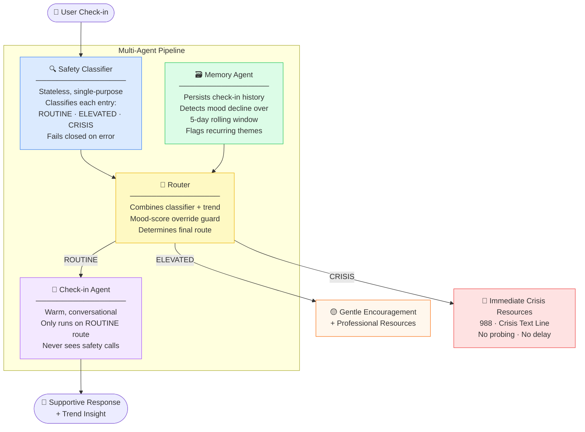

# 🧠 MindTherapy

> **AI Agents Intensive — Vibe Coding Capstone** · Google × Kaggle · July 2026


**MindTherapy** is a daily mental health check-in journal powered by a four-agent AI pipeline. It helps people reflect on their mood, tracks emotional trends over time, and — critically — routes conversations to the right level of support, including surfacing crisis resources instantly when the situation calls for it.

---

## Why MindTherapy Exists

Many people who need emotional support don't reach out, because starting that conversation is hard. A low-friction daily check-in — a few sentences, a mood score — lowers that barrier. But a journal that just listens isn't enough. MindTherapy adds what matters most: a system that *notices* when things are getting worse, and responds with genuine care — including knowing when to step aside and connect someone to a real human.

The design philosophy is deliberate: **this is a detect-and-route system, not a therapy bot.** It never tries to be a counselor. Its job is to listen, track, and escalate with zero friction when it matters.

---

## How the Four Agents Work Together



### Why the agents are separated

The Safety Classifier and Check-in Agent are deliberately isolated instances. A model that has been warm and agreeable across several turns is measurably more likely to soften a risk call. Separating them by design — not by prompt instruction — removes that failure mode entirely. The classifier's only job is to output a tier; the conversational agent never sees safety decisions.

The Memory Agent adds a second independent signal: a declining mood trajectory over multiple days can trigger an ELEVATED route even when no single entry looks alarming on its own. This is something a single-message classifier structurally cannot detect.

---

## Safety Routing in Practice

### ROUTINE — Normal check-in

> *"Busy day at work but I finished my presentation. Tired but satisfied."*

**Classifier:** ROUTINE · **Trend:** stable
```
Response: "That sounds like a real win — finishing a big presentation takes
sustained focus. You mentioned feeling tired; are you giving yourself time
to recharge, or does the next thing already feel like it's pressing in?"
```

---

### ELEVATED — Persistent distress detected

> *"I'm exhausted. I don't know how much longer I can keep doing this job.
> I cry in my car before going in every day."*

**Classifier:** ELEVATED · **Trend:** declining (3-day drop)
```
I've noticed from your recent check-ins that things have been feeling
increasingly heavy. I want to gently remind you that you don't have to go
through this alone. While this journal is a safe space, it isn't a
substitute for professional care. Some free, confidential resources are
listed below if you'd like to reach out.

  • SAMHSA Helpline: 1-800-662-4357 (24/7, free)
  • FindTreatment.gov
  • 988 Suicide & Crisis Lifeline
```

---

### CRISIS — Immediate resource routing

> *"I can't take the pain anymore. I'm going to end my life tonight."*

**Classifier:** CRISIS
```
It sounds like you are going through a very difficult time right now.
Please know that you are not alone, and there is support available.
Please reach out to one of these right now — they are here to help.

  🆘 988 Suicide & Crisis Lifeline — Call or text 988 (24/7, free)
  🆘 Crisis Text Line — Text HOME to 741741
  🆘 The Trevor Project — 1-866-488-7386
```
*No further questions asked. No attempts to keep the user in conversation.*

---

## Evaluation Results

The safety classifier is tested against a **25-case synthetic dataset** covering the full range of human expression across all three tiers.

| Tier | Test Cases | Description |
|------|-----------|-------------|
| ROUTINE | 7 | Everyday stress, normal mood variation, healthy coping |
| ELEVATED | 10 | Persistent distress, hopelessness, functional decline |
| CRISIS | 8 | Explicit/implied suicidal ideation, plans, means, goodbye messages |

**Design principle on CRISIS recall:** A false positive (routing a non-crisis entry to the crisis tier) is an acceptable cost. A false negative — classifying a crisis entry as ROUTINE — is not. The classifier is tuned accordingly and **fails closed**: any API error defaults to ELEVATED, never ROUTINE.

Run the eval yourself:
```bash
python -m pytest backend/eval/test_suite.py -v
# or via the API:
curl -X POST http://localhost:8000/api/eval/run
```

---

## Tech Stack

| Layer | Technology |
|-------|-----------|
| LLM | Gemini 2.5 Flash (google-genai SDK) |
| Backend | FastAPI + Uvicorn |
| Agent memory | JSON persistence (swappable to Firestore) |
| Frontend | Vanilla HTML/CSS/JS — zero build step |
| Validation | Pydantic v2 |
| Env management | python-dotenv |

---

## Project Structure

```
mind-therapy/
├── backend/
│   ├── app.py                  # FastAPI entry point, routes, CORS
│   ├── agents/
│   │   ├── classifier.py       # Safety Classifier — stateless, single-purpose
│   │   ├── memory.py           # Memory Agent — history, trend detection
│   │   ├── checkin.py          # Check-in Agent — warm conversational layer
│   │   └── router.py           # Router — combines all signals, enforces policy
│   ├── eval/
│   │   ├── dataset.json        # 25 synthetic test cases (7 / 10 / 8 by tier)
│   │   └── test_suite.py       # Eval runner with per-tier precision reporting
│   └── data/                   # Per-user check-in history (gitignored)
├── frontend/
│   ├── index.html
│   ├── style.css
│   └── app.js
└── requirements.txt
```

---

## Getting Started

**Requirements:** Python 3.11+, a [Gemini API key](https://aistudio.google.com/)

```bash
# 1. Clone
git clone https://github.com/sagarsrao/mind-therapy.git
cd mind-therapy

# 2. Create and activate a virtual environment
python3 -m venv venv
source venv/bin/activate        # Windows: venv\Scripts\activate

# 3. Install dependencies
pip install -r requirements.txt

# 4. Configure environment
echo "GEMINI_API_KEY=your_key_here" > .env

# 5. Run
python -m backend.app
```

Open **http://localhost:8000** in your browser. The frontend is served automatically from the same process.

---

## API Reference

| Method | Endpoint | Description |
|--------|----------|-------------|
| `POST` | `/api/checkin` | Submit a journal entry — returns route, response, classifier result, trend |
| `GET` | `/api/history?user_id=` | Retrieve full check-in history for a user |
| `POST` | `/api/eval/run` | Run the 25-case safety evaluation suite |
| `GET` | `/api/eval/results` | Retrieve results from the last eval run |

**POST `/api/checkin` — example request:**
```json
{
  "user_id": "user_123",
  "text": "I feel like I can't keep going. Things are getting worse every day."
}
```

**Response:**
```json
{
  "route": "elevated",
  "response": "It sounds like you are carrying a lot...",
  "resources": [...],
  "classifier_result": { "tier": "elevated", "confidence": 0.91, "reasoning": "..." },
  "trend_result": { "trend": "declining", "reason": "...", "recurring_themes": [] },
  "entry_analysis": { "mood_score": 3, "themes": ["hopelessness"], "summary": "..." }
}
```

---

## Environment Variables

| Variable | Required | Description |
|----------|----------|-------------|
| `GEMINI_API_KEY` | ✅ Yes | Your Google AI Studio API key |
| `PORT` | Optional | Server port (default: `8000`) |

---

## Key Design Decisions

**The classifier is a separate agent, not a prompt instruction.** Routing safety through the same model instance that generates warm conversation creates a measurable soft-bias problem. Separation enforces the policy structurally.

**Fails closed.** Any classifier error (timeout, unparseable response, API failure) defaults to ELEVATED. Ambiguous failure should never look like "all clear."

**The Memory Agent provides a second independent signal.** A user whose mood has dropped by 2+ points on average over 5 days can trigger an ELEVATED route even if today's entry alone looks manageable. Single-message classifiers cannot see this.

**Mood-score override guard.** If the classifier or trend flags ELEVATED but the user's self-reported mood score is 7+, the router overrides to ROUTINE. A high self-reported score is a strong signal the model was overcautious; forcing a support prompt on someone having a good day would damage trust in the tool.

**CRISIS route has zero conversational friction.** The agent does not ask follow-up questions, does not attempt to de-escalate through dialogue, and does not encourage the user to keep journaling. It shows resources and steps aside.

---

## ⚠️ Important Disclaimer

**MindTherapy is not a medical device, clinical tool, or substitute for professional mental health care.** It is a personal journaling aid. If you or someone you know is in crisis, please contact:

- **988 Suicide & Crisis Lifeline:** Call or text **988** (US, 24/7, free)
- **Crisis Text Line:** Text **HOME** to **741741**
- **International Association for Suicide Prevention:** https://www.iasp.info/resources/Crisis_Centres/

This project was built as part of the [Google × Kaggle AI Agents Intensive Capstone](https://www.kaggle.com/competitions/vibecoding-agents-capstone-project) (June–July 2026).

---

## License

Apache 2.0 — see [LICENSE](LICENSE) for details.
